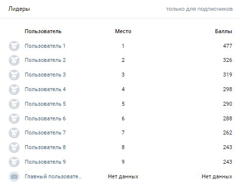

# VKStars

Баллы за активность в группе вконтакте

## Как это будет выглядеть
Если пользователь находится в топ 10

Если пользователь не находится в топ 10

Если пользователя нет в базе данных

## Использование

Устанавливаем зависимости

`pip install -r requirements.txt`

В файле `data/const.py` настраиваем значения

Запускаем `python get_stats.py` для сбора статистики группы

Запускаем `python app.py` для старта приложения
